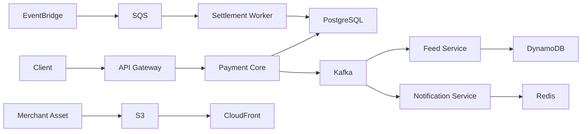

# SpotPay Platform

**현장결제(Offline QR) · 크로스보더 결제 · 혜택(선착순 쿠폰) · 실시간 알림 · 거래내역 피드**

주니어 서버 개발자가 **고성능/고가용성 설계**, **분산 트랜잭션 고민**,  **폴리글랏 퍼시스턴스(PostgreSQL + DynamoDB)**,  **캐시 · CDN · 메시징 · 관측성 · CI/CD · Kubernetes**를  “필요해서 도입하는 경험”을 할 수 있도록 설계한 백엔드 플랫폼 프로젝트입니다.

> **제품 관점 한 줄 요약**  
> 오프라인 QR 결제를 빠르고 안전하게 처리하고, 결제 이벤트를 기반으로 피드·알림·정산을 분리 확장하는 플랫폼

---

# 목차

- [왜 이 프로젝트인가](#왜-이-프로젝트인가)
- [핵심 사용자 시나리오](#핵심-사용자-시나리오)
- [아키텍처 개요](#아키텍처-개요)

---

# 왜 이 프로젝트인가

현장결제/크로스보더 결제 도메인은 다음이 동시에 요구됩니다.

- **정합성(돈)** — ACID 기반 트랜잭션 설계 필수
- **고성능(트래픽)** — p95/p99 지연 관리
- **고가용성(장애 대응)** — 외부 의존성 장애 시 서비스 유지 전략
- **API 사용자 관점 설계** — 버저닝, 멱등성, 에러 모델
- **이벤트 기반 확장성** — 결제 이후 기능을 독립 확장

이 프로젝트는 위 요구를 단순 기술 실습이 아니라  
**제품 요구사항 중심 설계 경험**으로 풀어냅니다.

---

# 핵심 사용자 시나리오

## 1. 현장결제 (Offline QR)

1. 사용자가 QR 스캔
2. 결제 요청 (Idempotency-Key 포함)
3. Payment Core가 PostgreSQL에 트랜잭션 처리
4. Kafka 이벤트 발행
5. 알림 및 피드 서비스 비동기 반영

---

## 2. 크로스보더 결제

- 환율/수수료 정책 조회
- 읽기 폭증 대비 캐시 전략 필요
- 로컬 캐시 + Redis 병행

---

## 3. 선착순 쿠폰 드랍

- 특정 시간 동시 요청 폭주
- 중복 요청
- 락 경쟁
- 캐시 스탬피드
- 핫스팟 문제

---

## 4. 정산 배치

- EventBridge 스케줄 트리거
- SQS 작업 큐
- DLQ 및 재처리 전략

---

# 아키텍처 개요

---
